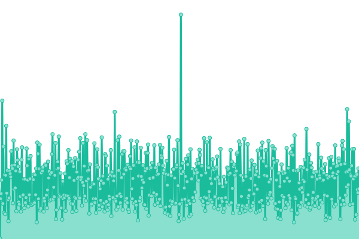
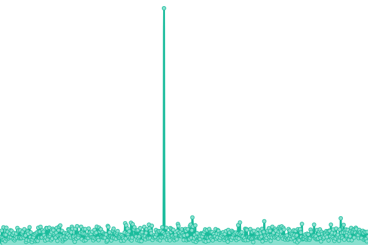
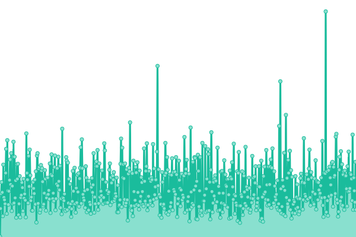
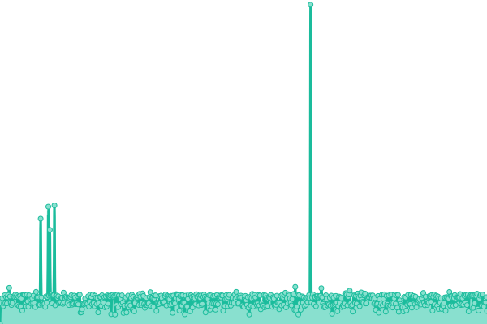
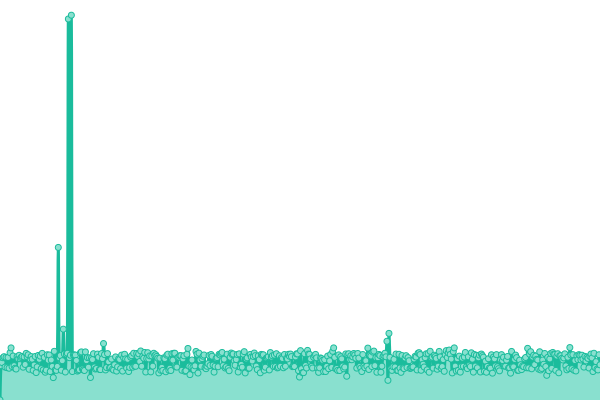
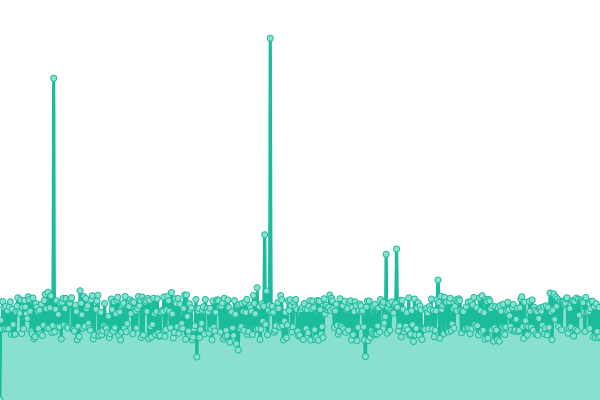

# [📈 Live Status](https://status.silentclient.net): <!--live status--> **🟩 All systems operational**

This repository contains the open-source uptime monitor and status page for [Silent Client](silentclient.net), powered by [Upptime](https://github.com/upptime/upptime).

With [Upptime](https://upptime.js.org), you can get your own unlimited and free uptime monitor and status page, powered entirely by a GitHub repository. We use [Issues](https://github.com/Silent-Client/status/issues) as incident reports, [Actions](https://github.com/Silent-Client/status/actions) as uptime monitors, and [Pages](https://status.silentclient.net) for the status page.

<!--start: status pages-->
<!-- This summary is generated by Upptime (https://github.com/upptime/upptime) -->
<!-- Do not edit this manually, your changes will be overwritten -->
<!-- prettier-ignore -->
| URL | Status | History | Response Time | Uptime |
| --- | ------ | ------- | ------------- | ------ |
|  [Landing](https://silentclient.net) | 🟩 Up | [landing.yml](https://github.com/Silent-Client/status/commits/HEAD/history/landing.yml) | 

 152ms
     
 | 

<a href="https://status.silentclient.net/history/landing">100.00%</a>
    

|  [Store](https://store.silentclient.net) | 🟩 Up | [store.yml](https://github.com/Silent-Client/status/commits/HEAD/history/store.yml) | 

 135ms
     
 | 

<a href="https://status.silentclient.net/history/store">100.00%</a>
    

|  [Admin](https://admin.silentclient.net) | 🟩 Up | [admin.yml](https://github.com/Silent-Client/status/commits/HEAD/history/admin.yml) | 

 135ms
     
 | 

<a href="https://status.silentclient.net/history/admin">100.00%</a>
    

|  [API](https://api.silentclient.net) | 🟩 Up | [api.yml](https://github.com/Silent-Client/status/commits/HEAD/history/api.yml) | 

 328ms
     
 | 

<a href="https://status.silentclient.net/history/api">88.16%</a>
    

|  [Microsoft Auth API](https://auth.silentclient.net) | 🟩 Up | [microsoft-auth-api.yml](https://github.com/Silent-Client/status/commits/HEAD/history/microsoft-auth-api.yml) | 

 337ms
     
 | 

<a href="https://status.silentclient.net/history/microsoft-auth-api">88.17%</a>
    

|  [Players API](https://players.silentclient.net) | 🟩 Up | [players-api.yml](https://github.com/Silent-Client/status/commits/HEAD/history/players-api.yml) | 

 339ms
     
 | 

<a href="https://status.silentclient.net/history/players-api">88.19%</a>
    

|  [Cosmetics CDN](https://cosmetics.silentclient.net) | 🟩 Up | [cosmetics-cdn.yml](https://github.com/Silent-Client/status/commits/HEAD/history/cosmetics-cdn.yml) | 

 779ms
     
 | 

<a href="https://status.silentclient.net/history/cosmetics-cdn">58.46%</a>
    

<!--end: status pages-->

[**Visit our status website →**](https://status.silentclient.net)

## 📄 License

- Powered by: [Upptime](https://github.com/upptime/upptime)
- Code: [MIT](./LICENSE) © [Silent Client](silentclient.net)
- Data in the `./history` directory: [Open Database License](https://opendatacommons.org/licenses/odbl/1-0/)
